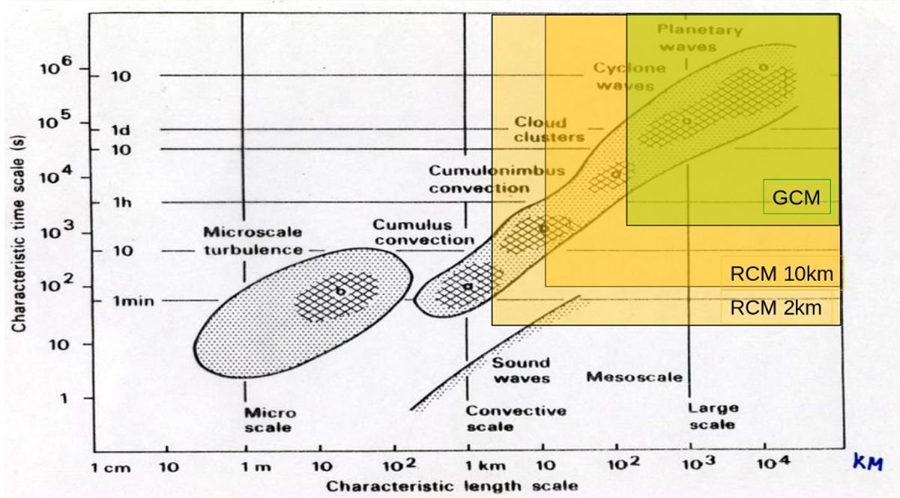
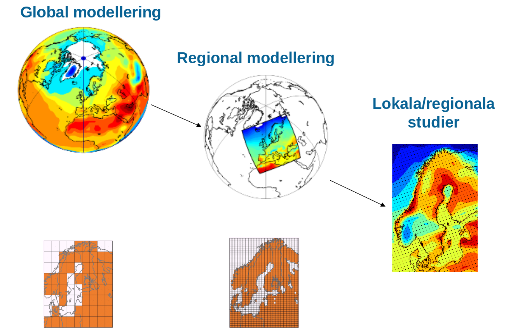

class: center, middle

# Hur klimatmodeller hjälper oss förstå dagens och framtidens klimat

## Petter Lind

Rossby Centre, SMHI

---

class: inverse

## Rossby Centre

Nyligen 20 år fyllda

- Vad pysslar vi med?
- Varför då?

---
class: middle, center, black_bg

.cite[NASA Worldview (https://worldview.earthdata.nasa.gov/)]

---
class: middle, center

# Hur känsligt är klimatet?

---
class: top, center, black_bg

---

class: middle

### Atmosfären är ett kaotiskt system

---

class: middle
count: false

### Atmosfären är ett kaotiskt system

---

class: middle, center

# Klimat är statistik över vädret!

---

class: middle, center

# Vad är en klimatmodell?

---

class: middle, center, black_bg

---

class: middle, center

---

class: middle

### Längd- och tidsskalor

---

class: middle
count: false

### Längd- och tidsskalor

---

class: middle
count: false

### Längd- och tidsskalor

---

class: middle

### Hur bra är modellerna?

---

class: middle

### Osäkerheter i framtiden?

---

class: middle
count: false

### Osäkerheter i framtiden (1/2)?

---

class: middle
count: false

### Osäkerheter i framtiden (2/2)?

---

class: top

## Globala mönster

---

class: middle

## Lokalt kan "felen" bli stora

.cite[Lind & Kjellström, SMHI RMK (2008)]

---

class: middle

## Regionala klimatmodeller viktigt verktyg

---

class: middle

## Mer nederbörd i framtiden i Sverige

---

class: middle

## På sommaren torrare med mer intensiv nederbörd!

---

class: middle

## Osäkerheter kopplat till moln-problematiken

"The fate of humanity depends on how clouds will respond to our emissions of CO2"
(T. Palmer, climate scientist)

---

class: middle

## Högre modell-upplösning ger bättre beskriving av väder och klimat

---

class: middle
count : false

## Högre modell-upplösning ger bättre beskriving av väder och klimat

---

class: middle

## Kraftfullare datorer behövs för att reducera osäkerheterna
Exascale: 10^18 flyttalsoperationer per sekund (EXAFLOP) 

---

## Videos
<video width="800" controls>
  <source src="img/nasa_worldview_visible_sequence.gif" type="video/gif">
  Your browser does not support HTML5 video.
</video>

---

## Slide notes

- Press P, to get presentation mode and see if you have any notes..

???
This is my notes and only visible to me..
