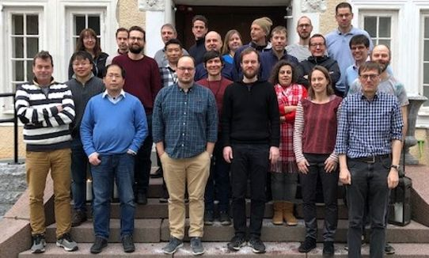
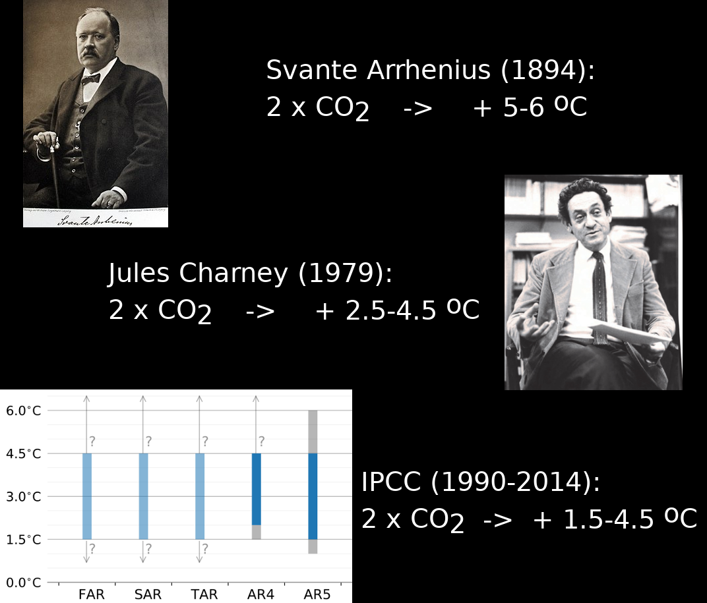
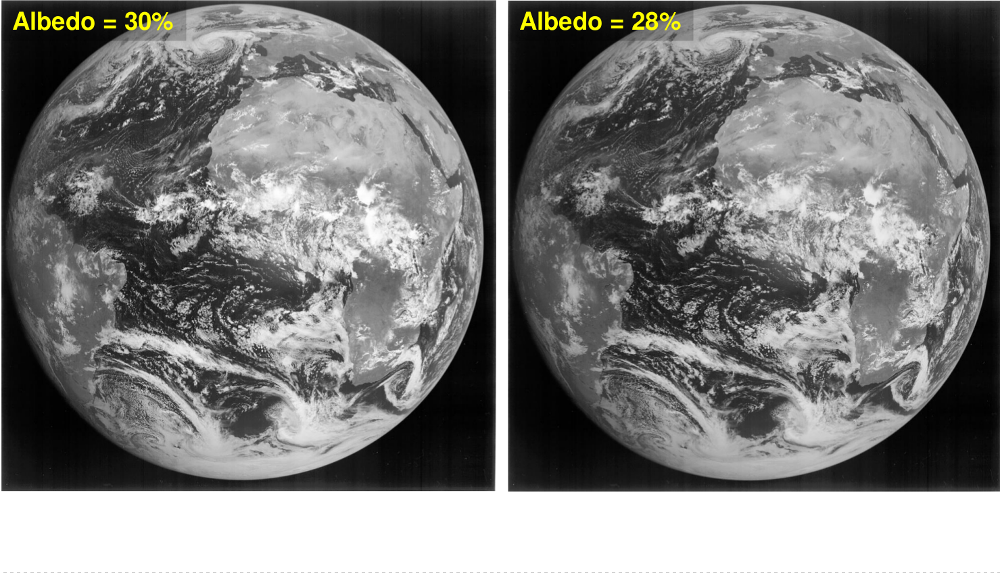

class: center, middle

# Hur klimatmodeller hjälper oss förstå dagens och framtidens klimat

## Petter Lind

### Rossby Centre, SMHI

---

class: inverse

# Rossby Centre
.left-column[
- Nyligen 20-års jubileum; etablerat 1997
- Ett drygt 20-tal anställda: klimatforskare, datorforskare, kommunikatörer 
- Bidrar med klimatmodell-data till CMIP5 vilket utgör en av hörnstenarna till
   IPCC-rapporterna. 
- SMHI världsledande producent av regionala klimatprojektioner. 
]
.right-column[
- Verksamhet:
    - Förståelse av klimatet och dess prediktabilitet
    - Utveckling och tillämpning av numeriska klimatmodeller
    - Produktion och analys av klimatscenarier
    - Stöd för effektstudier och anpassningsarbete
]

---

class: middle, center, black_bg

.cite[NASA Worldview (https://worldview.earthdata.nasa.gov/)]

---
class: middle, center

# Hur känsligt är klimatet?

---
class: top, center, black_bg

---

class: middle, center, inverse

# Hur kan vi säga något om klimatet 100 år fram i tiden när vi inte ens kan säga något om vädret de närmaste tre veckorna?

---

class: middle

### Atmosfären är ett kaotiskt system

---

class: middle
count: false

### Atmosfären är ett kaotiskt system

---

class: middle, center

# Klimat är statistik över vädret!

---

class: middle, center

# Vad är en klimatmodell?

---

class: middle, center, black_bg

---

class: middle, center

---

class: middle

## Längd- och tidsskalor

---

class: middle
count: false

## Längd- och tidsskalor

---

class: middle
count: false

## Längd- och tidsskalor

---

class: middle

# Hur bra är modellerna?

---

class: middle

## Framtida klimatförändringar

---

class: middle
count: false

## Osäkerheter i framtiden (1/2)?

---

class: middle
count: false

## Osäkerheter i framtiden (2/2)?

---

class: top

# Globala mönster

---

class: middle

## Regionalt och lokalt kan avvikelserna bli stora

.cite[Lind & Kjellström, SMHI RMK (2008)]

---

class: middle

## Regionala klimatmodeller viktigt verktyg

---

class: middle

## Mer nederbörd i framtiden i Sverige

---

class: middle

## På sommaren torrare med mer intensiv nederbörd!

---

class: middle

# Osäkerheter starkt kopplat till "moln-problematiken"

## "The fate of humanity depends on how clouds will respond to our emissions of CO2" (T. Palmer, climate scientist)

---

class: middle

## Liten skillnad i planetens reflektans har stor betydelse

---

class: middle
count: false

## Liten skillnad i planetens reflektans har stor betydelse

---

class: middle
count: false

## Liten skillnad i planetens reflektans har stor betydelse

---

class: middle
count: false

## Högre upplösning ger bättre beskriving av väder & klimat

---

class: middle
count: false

## Högre upplösning ger bättre beskriving av väder & klimat

.cite[Simulering över Alperna; Lind et al. (2016)]

---

class: middle

## Kraftfullare datorer behövs för att reducera osäkerheterna
### Exascale: `\(10^{18}\)` flyttalsoperationer per sekund (EXAFLOP) 

---

class: middle, center

# Tack för mig!

